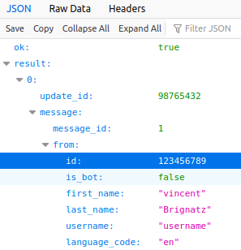

# NOSE : Notify On Script End

This script will send you a telegram message when your program ends.

## Setup

To use this script, you will need a telegram bot. See [here](https://core.telegram.org/bots#3-how-do-i-create-a-bot) to create one.

Then, start a conversation with this bot.

By going to `https://api.telegram.org/bot\<token\>/getUpdates`, you should be able to find the chat id.



Enter the token and the chat id in `nose.sh`, and you're done !

## Usage

To use nose, simply add nose after your command. For exemple :
```bash
Exemple : sleep 2 ; ./nose.sh "I have slept for 2 sec !"
```
